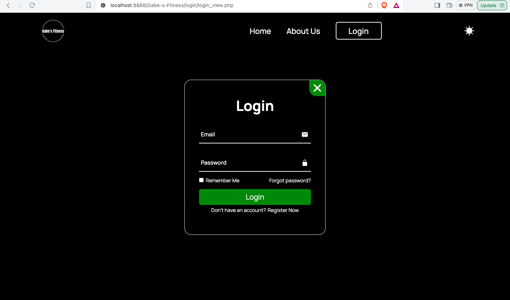
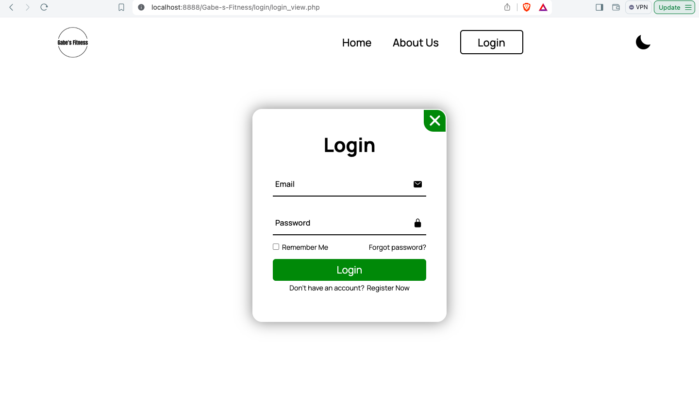
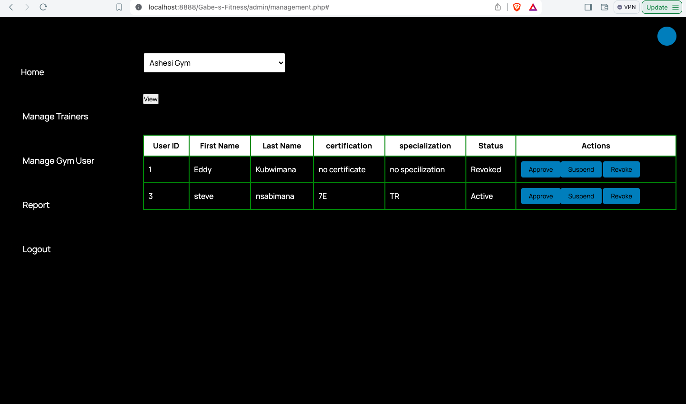
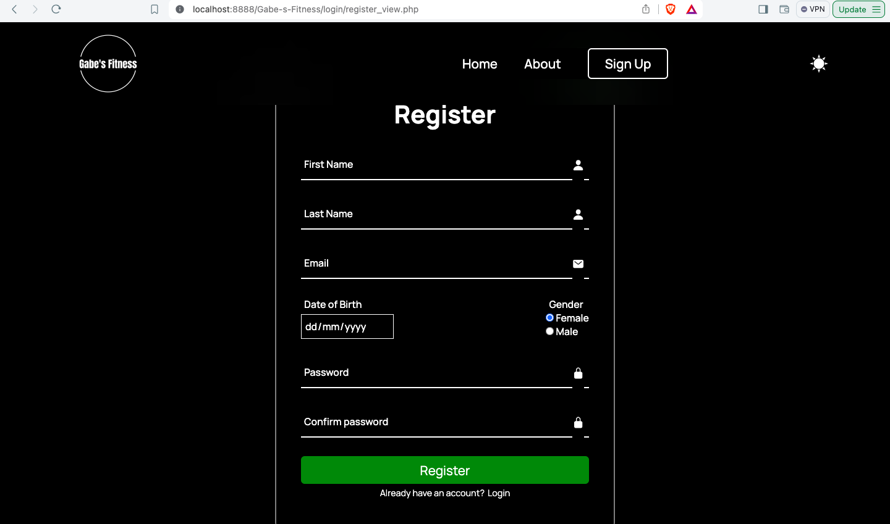

# Gabe Fitness Project

[](https://opensource.org/licenses/MIT)

## Table of Contents

- [Introduction](#introduction)
- [Features](#features)
- [Installation](#installation)
- [Usage](#usage)
- [Contributing](#contributing)
- [License](#license)
- [Contact](#contact)

## Introduction

Welcome to Gabe's Fitness! This repository contains the code for a comprehensive fitness web application designed to help users track their workouts, monitor progress, and stay motivated on their fitness journey. The application includes features such as admin accepting fitness trainer or declining their application, gym membership management,  workout logging, and progress tracking etc.

## Features

- **Membership Management**: Create,update , and delete tasks.
- **Track attendance logs**: create, edit, delete attendance log.
- **Trainer and gym goer Management**: approve or decline access
- **User Management**: Admin interface for gym owners to manaage all user on the platform.

## Installation

To install and run ChoresProject locally, follow these steps:

1. **Clone the repository**:
    ```bash
    git clone https://github.com/WebTech9-Ash/Gabe-s-Fitness
    ```

2. **Navigate to the project directory**:
    ```bash
    cd Gabe-s-Fitness
    ```

3. **Install the necessary software**:
    - MAMP for MacOs, XAMP for Windows
    - Download the Database and run into php Admin in your MAMP or XAMP

4. **Start the application**:
    ```bash
    npm start
    ```

## Usage

Once the application is running, open your web browser and navigate to `http://localhost:8888` to access the ChoresProject interface. From there, you can perform different CRUD activities:

## Screenshots

Here are some screenshots of the application:

### Login Page night mode


### Login Page normal mode



### Dashboard


### Landing page night mode


### Landing page normal mode


### Register dark mode



  
## Contributing

We welcome contributions from the community! If you'd like to contribute, please follow these steps:

1. Fork the repository.
2. Create a new branch (`git checkout -b feature/YourFeature`).
3. Make your changes and commit them (`git commit -m 'Add some feature'`).
4. Push to the branch (`git push origin feature/YourFeature`).
5. Open a pull request.


## License

This project is licensed under the MIT License. See the [LICENSE](LICENSE) file for more details.

## Contact

For any questions or feedback, feel free to reach out:

- **Name**: Eddy Kubwimana
- **Email**: [eddy.kubwimana@ashesi.edu.gh](mailto:eddy.kubwimana@ashesi.edu.gh)
- **GitHub**: [EddyKubwimana](https://github.com/EddyKubwimana)

---

Thank you for using ChoresProject! We hope it helps make managing your household chores easier and more efficient.
